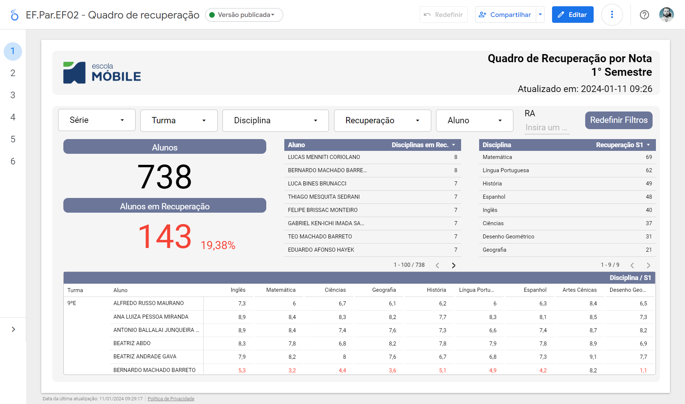
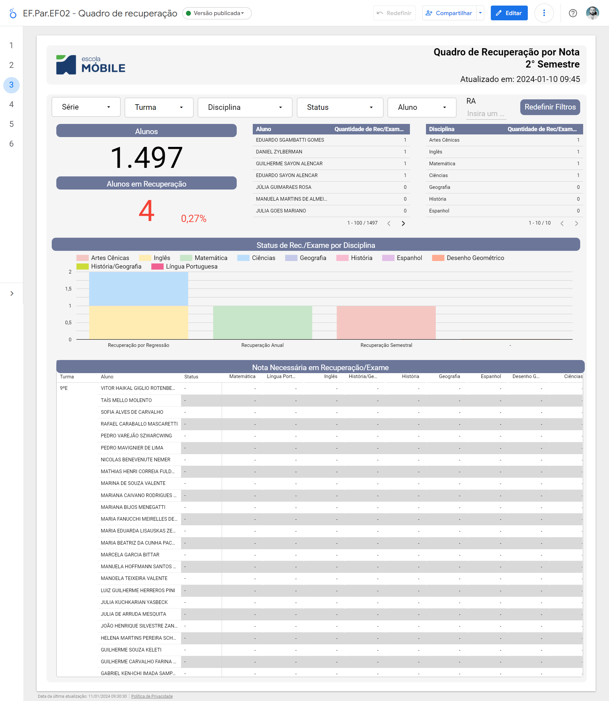
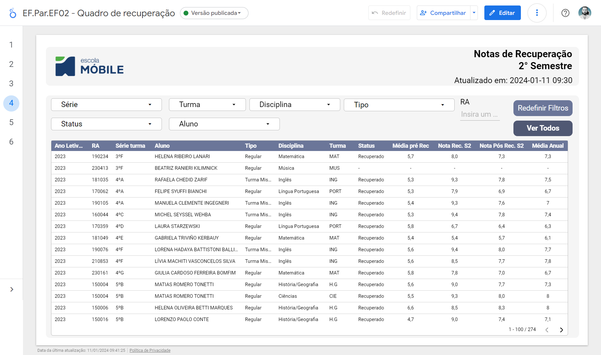
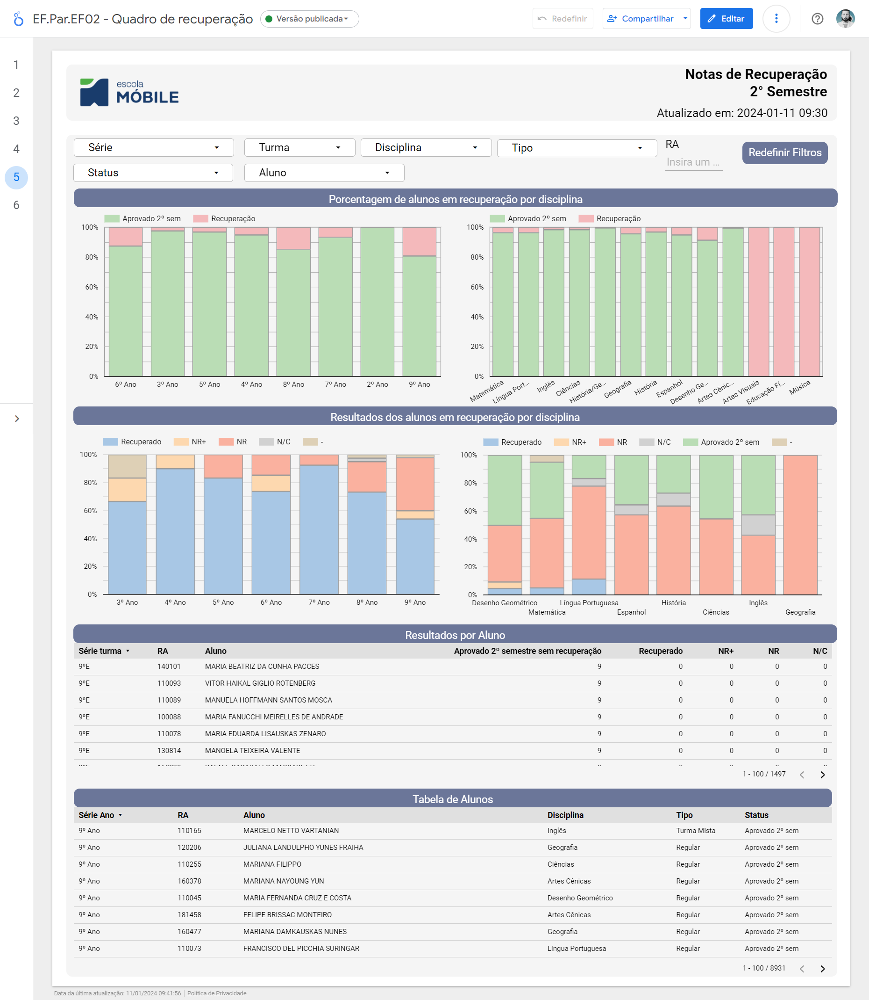
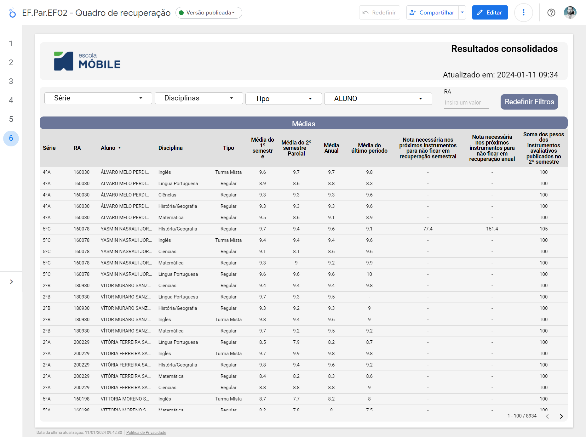

# Documentação dos Relatórios

## [EF.Par.EF02 - Quadro de Recuperação (Fundamental Parcial)](https://lookerstudio.google.com/reporting/86fec3d8-9b97-4ebf-8513-165e41b3fcd6/page/p_gpnxuc434c)

### 1° Semestre

**Quadro de Recuperação por Nota**
> Este quadro apresenta a quantidade de alunos em recuperação, permitindo filtros por série, turma, disciplina e aluno-RA. Também possibilita agrupar os alunos por disciplina, visualizando a quantidade de disciplinas em que cada aluno está em recuperação.

 **Resultados de Recuperação**
  > Nesta seção, são exibidas as notas de recuperação dos alunos, incluindo informações como ano letivo, RA, aluno, série, tipo de turma, disciplina, turma, status, média pré-recuperação e média pós recuperação.
  

### 2° Semestre

- **Quadro de Recuperação por Nota**
  > Similar ao primeiro semestre, este quadro permite verificar a quantidade de alunos em recuperação, com filtros por série, turma, disciplina e aluno-RA. Também oferece a possibilidade de agrupar os alunos por disciplina e visualizar a quantidade de disciplinas em que cada aluno está em recuperação.
  

- **Resultados de Recuperação no 2° Semestre**
  > Apresenta os resultados da recuperação no segundo semestre, exibindo a média antes da recuperação, a nota de recuperação e a média final do aluno, incluindo a média anual conforme exibida no boletim.
  

- **Análise de Resultados de Recuperação no 2° Semestre**
  > Esta seção agrupa informações em gráficos para análises rápidas, mostrando o percentual de alunos em recuperação por disciplina e o resultado dos alunos em recuperação. Inclui os alunos que recuperaram, os que não recuperaram, mas obtiveram uma nota maior e os que obtiveram uma nota menor na recuperação.

- **Resultados Consolidados**
  > Apresenta uma tabela com informações da série, RA, disciplina, tipo de turma, média do primeiro semestre, média parcial do segundo semestre, média anual parcial, nota do último período, nota necessária nos próximos instrumentos para evitar recuperação semestral, nota necessária nos próximos instrumentos para evitar recuperação anual e a soma dos pesos dos instrumentos avaliativos até o momento (a soma dos pesos deve ser 100 no final do semestre).

## [EF.Int.EF02 - Quadro de Recuperação (Fundamental Integral)](https://lookerstudio.google.com/reporting/927b9af7-561e-4692-aba5-e557ce06bad9/page/p_gpnxuc434c)

### 1° Semestre

- **Quadro de Recuperação por Nota**
  > Este quadro apresenta a quantidade de alunos em recuperação, permitindo filtros por série, turma, disciplina e aluno-RA. Também possibilita agrupar os alunos por disciplina, visualizando a quantidade de disciplinas em que cada aluno está em recuperação.

- **Resultados de Recuperação**
  > Nesta seção, são exibidas as notas de recuperação dos alunos, incluindo informações como ano letivo, RA, aluno, série, tipo de turma, disciplina, turma, status, média pré-recuperação e média pós recuperação.

- **Análise de Resultados de Recuperação**
  > Esta seção agrupa informações em gráficos para análises rápidas, mostrando o percentual de alunos em recuperação por disciplina e o resultado dos alunos em recuperação. Inclui os alunos que recuperaram, os que não recuperaram, mas obtiveram uma nota maior e os que obtiveram uma nota menor na recuperação.

### 2° Semestre

- **Quadro de Recuperação por Nota**
  > Similar ao primeiro semestre, este quadro permite verificar a quantidade de alunos em recuperação, com filtros por série, turma, disciplina e aluno-RA. Também oferece a possibilidade de agrupar os alunos por disciplina e visualizar a quantidade de disciplinas em que cada aluno está em recuperação.

- **Resultados de Recuperação**
  > Apresenta os resultados da recuperação no segundo semestre, exibindo a média antes da recuperação, a nota de recuperação e a média final do aluno, incluindo a média anual conforme exibida no boletim.

- **Análise de Resultados de Recuperação**
  > Esta seção agrupa informações em gráficos para análises rápidas, mostrando o percentual de alunos em recuperação por disciplina e o resultado dos alunos em recuperação. Inclui os alunos que recuperaram, os que não recuperaram, mas obtiveram uma nota maior e os que obtiveram uma nota menor na recuperação.

- **Resultados Consolidados**
  > Apresenta uma tabela com informações da série, RA, disciplina, tipo de turma, média do primeiro semestre, média parcial do segundo semestre, média anual parcial, nota do último período, nota necessária nos próximos instrumentos para evitar recuperação semestral, nota necessária nos próximos instrumentos para evitar recuperação anual e a soma dos pesos dos instrumentos avaliativos até o momento (a soma dos pesos deve ser 100 no final do semestre).

## [EM.EF02 - Quadro de Recuperação (Médio)](https://lookerstudio.google.com/reporting/cca02dcf-73dc-4a13-bf8f-019faee084df/page/p_gpnxuc434c)

### 1° Semestre

- **Quadro de Recuperação**
  > Este quadro apresenta a quantidade de alunos em recuperação, permitindo filtros por série, turma, disciplina e aluno-RA. Também possibilita agrupar os alunos por disciplina, visualizando a quantidade de disciplinas em que cada aluno está em recuperação.

- **Resultados de Recuperação**
  > Nesta seção, são exibidas as notas de recuperação dos alunos, incluindo informações como ano letivo, RA, aluno, série, tipo de turma, disciplina, turma, status, média pré-recuperação e média pós recuperação.

- **Análise de Resultados de Recuperação**
  > Esta seção agrupa informações em gráficos para análises rápidas, mostrando o percentual de alunos em recuperação por disciplina e o resultado dos alunos em recuperação. Inclui os alunos que recuperaram, os que não recuperaram, mas obtiveram uma nota maior e os que obtiveram uma nota menor na recuperação.

### 2° Semestre

- **Quadro de Recuperação 2° Semestre**
  > Similar ao primeiro semestre, este quadro permite verificar a quantidade de alunos em recuperação, com filtros por série, turma, disciplina e aluno-RA. Também oferece a possibilidade de agrupar os alunos por disciplina e visualizar a quantidade de disciplinas em que cada aluno está em recuperação.

- **Resultados de Recuperação**
  > Apresenta os resultados da recuperação no segundo semestre, exibindo a média antes da recuperação, a nota de recuperação e a média final do aluno, incluindo a média anual conforme exibida no boletim.

- **Análise de Resultados de Recuperação**
  > Esta seção agrupa informações em gráficos para análises rápidas, mostrando o percentual de alunos em recuperação por disciplina e o resultado dos alunos em recuperação. Inclui os alunos que recuperaram, os que não recuperaram, mas obtiveram uma nota maior e os que obtiveram uma nota menor na recuperação.

- **Resultados Consolidados**
  > Apresenta uma tabela com informações da série, RA, disciplina, tipo de turma, média do primeiro semestre, média parcial do segundo semestre, média anual parcial, nota do último período, nota necessária nos próximos instrumentos para evitar recuperação semestral, nota necessária nos próximos instrumentos para evitar recuperação anual e a soma dos pesos dos instrumentos avaliativos até o momento (a soma dos pesos deve ser 100 no final do semestre).

## [Acompanhamento de Matriz Curricular](https://lookerstudio.google.com/reporting/0f61d938-fa0e-4780-8cf4-60a5916a53d5/page/RVPaD)

O propósito deste relatório é acompanhar o preenchimento das planilhas de matriz curricular, onde os professores inserem informações essenciais como ementas do curso, objetos de conhecimento e expectativas de aprendizagem.

**Principais Características:**

- **Identificação de Campos Ausentes:** O relatório destaca campos não preenchidos nas diferentes planilhas, proporcionando uma rápida identificação de áreas que necessitam de atenção.

- **Link Direto para Google Sheets:** Na própria tabela do relatório, é fornecido um [link direto](https://lookerstudio.google.com/reporting/0f61d938-fa0e-4780-8cf4-60a5916a53d5/page/RVPaD) para a planilha específica no Google Sheets. Isso facilita o acesso imediato para correções ou atualizações.

- **Filtros Personalizáveis:** Possui funcionalidades de filtro por ciclo, área do conhecimento, componente curricular e série, proporcionando uma visão personalizada e segmentada das informações.

Este relatório foi desenvolvido com o intuito de otimizar o controle e acompanhamento da matriz curricular, garantindo a integridade e a qualidade das informações inseridas pelos professores.

## [Relatório Pesquisa de Procura](https://lookerstudio.google.com/reporting/2c5d1bb2-bc29-4335-9361-7131bee5b58e/page/G8mGD)

### Visão Geral
Explore uma visão abrangente das inscrições ao longo dos anos, iniciando em 2019 (excluindo 2020 e 2021 sem dados coletados). Este relatório apresenta a quantidade anual de manifestações e matrículas, incluindo a taxa de desistência. As informações são apresentadas em gráficos e no formato de funil, destacando inscrições, manifestações, chamados, matrículas e um gráfico de matrículas por ciclo.

### Funil de Ingresso
Esta seção contém dois funis: o primeiro mostra a quantidade de candidatos em cada etapa, enquanto o segundo indica quantos candidatos passaram por cada uma das cinco etapas: Inscrição, Reunião, Manifestação, Pré-matrícula e Matriculado.

### Evolução de Inscrições
Encontre três gráficos temporais, destacando as inscrições acumuladas ao longo dos dias do processo, as inscrições diárias e o total de inscrições durante o período.

### Migração
Fornece informações sobre ingresso, mudança de período (entrada e saída) e migração (entrada e saída).

### Pesquisa de Ingresso
Apresenta as respostas da pesquisa de ingresso em gráficos de pizza.

### Evolução Temporal
Esta página exibe informações de inscrições, manifestações, chamados e desistências ao longo dos anos em gráficos de barras.

### Desistências
Permite visualizar a quantidade de desistências por ciclo (Médio, Infantil, Fundamental 1 e 2), incluindo desistências por núcleo (Parcial e Integral).

### Manifestações
Apresenta manifestações por ciclo (Médio, Infantil, Fundamental 1 e 2) e comparações de manifestações por núcleo e anualmente.

### Evasão
Fornece dados sobre a quantidade de alunos que evadiram, segmentados por ano, mês e ciclo.

### Motivo de Evasão
Agrupa os motivos de evasão coletados pelos coordenadores/secretarias ao longo dos anos, observando a diversidade de dados devido à coleta manual.

### Escolas
Agrupa as escolas para as quais os alunos que evadiram foram, com dados coletados pelos coordenadores/secretarias ao longo dos anos.

## [Inscrições: Extracurriculares e Treinamentos Esportivos](https://lookerstudio.google.com/reporting/b46d5a8e-3f9c-4f17-9f0b-36ceed5e4f37/page/KQMkD)

Este relatório foi desenvolvido para auxiliar na análise dos dados provenientes dos formulários sobre os cursos extracurriculares e esportes criados por Raffaella Kazantzi.

### Integral

Apresenta informações sobre a quantidade de respostas do formulário, alunos distintos e escolhas por curso de esporte e curso extracurricular. Os filtros permitem segmentar por Categoria (mirim, pré-mirim, infantil e infantojuvenil), gênero, série e aluno. Observa-se que os filtros de dias e horários possuem algumas limitações de funcionalidade devido a problemas na base de dados.

### Parcial e EM

Similar à seção anterior, fornece dados sobre a quantidade de respostas do formulário, alunos distintos e escolhas por curso de esporte e curso extracurricular. Os filtros permitem a segmentação por Categoria (mirim, pré-mirim, infantil e infantojuvenil), gênero, série e aluno. Ressalta-se que os filtros de dias e horários também apresentam limitações de funcionalidade devido a questões na base de dados.

### Quantidade de Alunos por Ofertas

Essa visualização mantém os mesmos filtros das seções anteriores, contudo, concentra-se exclusivamente em informações relacionadas a Parcial e EM. Exibe, por meio de um gráfico de coluna empilhada, a distribuição das escolhas de esportes em relação aos dias da semana.

## [EF.Par.EP03 - Controle de Instrumentos Avaliativos](https://lookerstudio.google.com/reporting/6fe8aa24-da51-4ff7-ac8a-330a2d4c7edb/page/p_gpnxuc434c)

Desenvolvido com o objetivo de acompanhar a publicação dos instrumentos avaliativos.

### Fechamento de Provas

Apresenta uma tabela informativa com os instrumentos avaliativos, seus pesos, períodos, turmas, disciplinas, tipos de avaliação, o ID da avaliação e um status de publicação.

É possível realizar filtros por série, período, tipo de avaliação, disciplina e o nome da avaliação.

### Pesos Parciais

Inclui um gráfico de coluna e uma tabela informativa que exibe a soma dos pesos por série, disciplina e turma. Vale ressaltar que esses pesos devem totalizar 100 no final do semestre.

## [Pesquisa de Clima - 2023 (2024)](https://lookerstudio.google.com/reporting/acfd16c8-806b-4d0d-a990-a7bc0a177661/page/p_5r58u8i54c)

Relatório criado para auxiliar o RH na apuração da pesquisa de clima. Este relatório permanece em desenvolvimento e possui acesso exclusivo para a equipe de Recursos Humanos.

## [Pesquisa Satisfação - 2023](https://lookerstudio.google.com/reporting/c4bf4535-d221-49f3-9660-2b9fc86a8fe8/page/p_5r58u8i54c)

Relatório criado com o objetivo de gerar o Net Promoter Score (NPS) dos pais em relação aos serviços prestados pela escola. Apresenta o NPS Global, percentual de respostas, percentual de Detratores, NPS, respondido e a quantidade de respostas. Inclui, também, uma tabela com os comentários/sugestões, juntamente com a nota atribuída pelos respondentes na pesquisa.

## [EM.EF01 - Relatório sobre Alunos](https://lookerstudio.google.com/reporting/e1eace1e-e919-465f-a288-81158b72e75f/page/p_n4rk3hz94c)

### Análise Individual

Contém informações sobre o aluno, como sua foto, a média parcial ponderada por disciplina, percentual de presença por disciplina e uma tabela com suas notas em instrumentos avaliativos, além da quantidade de lições entregues e pendentes, juntamente com um percentual de aproveitamento.

### Instrumentos Avaliativos

Apresenta os instrumentos avaliativos e suas notas por aluno, permitindo filtrar pelos instrumentos publicados ou não publicados, bem como por semestre, período, série, turma, disciplina, nome do aluno, instrumento e RA.

### Lição de Casa

Contém informações sobre o percentual de aproveitamento de lição de casa por aluno e disciplina, além das quantidades absolutas de lições entregues e não entregues.

### Média Parcial Ponderada

Exibe as médias parciais ponderadas dos alunos por disciplina e semestre, permitindo filtrar por semestre, série, turma, tipo, disciplina, nome do aluno e RA.

### Média Necessária para Aprovação

Apresenta a média necessária que o aluno precisa tirar nos próximos instrumentos avaliativos para ser aprovado no primeiro semestre.

### Presença Alunos

Exibe o percentual de presença dos alunos por disciplina.

### Análise Coletiva - Notas

Apresenta informações agrupadas por turma e disciplina de notas, possibilitando realizar uma análise sobre o desempenho das turmas e das disciplinas de maneira geral.

### Análise Coletiva - Presenças

Exibe informações agrupadas por turma e disciplina de presença, possibilitando realizar uma análise sobre o desempenho das turmas e das disciplinas de maneira geral.

## [Financeiro](https://lookerstudio.google.com/reporting/2af9348d-3161-4cc0-b25e-e67a6c6a6a3a/page/AoijD)

Relatório em desenvolvimento com o objetivo de auxiliar os setores financeiro e de Recursos Humanos no controle de custos com horas e folha de pagamento.

## [EF.Par.EF01 - Relatório sobre Alunos](https://lookerstudio.google.com/reporting/476e2875-5ca7-4a41-b40d-3e1f31c05e4b/page/p_n4rk3hz94c)

### Análise Individual

Contém informações sobre o aluno, incluindo sua foto, média parcial ponderada por disciplina, percentual de presença por disciplina, uma tabela com suas notas em instrumentos avaliativos, a quantidade de lições entregues e pendentes, juntamente com um percentual de aproveitamento.

### Instrumentos Avaliativos

Apresenta os instrumentos avaliativos e suas notas por aluno. É possível realizar filtros pelos instrumentos publicados ou não publicados, assim como por semestre, período, série, turma, disciplina, nome do aluno, instrumento e RA.

### Lição de Casa

Contém informações sobre o percentual de aproveitamento de lição de casa por aluno e disciplina, além das quantidades absolutas de lições entregues e não entregues.

### Média Parcial Ponderada

Exibe as médias parciais ponderadas dos alunos por disciplina e semestre. É possível realizar filtros por semestre, série, turma, tipo, disciplina, nome do aluno e RA.

### Média Necessária para Aprovação

Apresenta a média necessária que o aluno precisa tirar nos próximos instrumentos avaliativos para ser aprovado no primeiro semestre.

### Presença Alunos

Exibe o percentual de presença dos alunos por disciplina.

### Análise Coletiva - Notas

Contém informações agrupadas por turma e disciplina de notas, possibilitando realizar uma análise sobre o desempenho das turmas e das disciplinas de maneira geral.

### Análise Coletiva - Presenças

Contém informações agrupadas por turma e disciplina de presença, possibilitando realizar uma análise sobre o desempenho das turmas e das disciplinas de maneira geral.

## [EF.Par.EF01.prof - Relatório sobre Alunos](https://lookerstudio.google.com/reporting/4934e3af-5dde-417a-8d8b-a20927c8d415/page/p_nz81lknj8c)

### Instrumentos Avaliativos

Apresenta os instrumentos avaliativos e suas notas por aluno. É possível filtrar pelos instrumentos publicados ou não publicados, assim como por semestre, período, série, turma, disciplina, nome do aluno, instrumento e RA.

### Média Parcial Ponderada

Contém as médias parciais ponderadas dos alunos por disciplina e semestre. É possível realizar filtros por semestre, série, turma, tipo, disciplina, nome do aluno e RA.

### Lição de Casa

Exibe informações de percentual de aproveitamento de lição de casa por aluno e disciplina, além das quantidades absolutas de lições entregues e não entregues.

### Média Necessária para Aprovação

Apresenta a média necessária que o aluno precisa tirar nos próximos instrumentos avaliativos para ser aprovado no primeiro semestre.

### Análise Coletiva - Notas

Contém informações agrupadas por turma e disciplina de notas, possibilitando realizar uma análise sobre o desempenho das turmas e das disciplinas de maneira geral.

### Resultados Consolidados

Apresenta uma tabela com informações da série, RA, disciplina, tipo de turma, média do primeiro semestre, média parcial do segundo semestre, média anual parcial, nota do último período, nota necessária nos próximos instrumentos para evitar recuperação semestral, nota necessária nos próximos instrumentos para evitar recuperação anual e a soma dos pesos dos instrumentos avaliativos até o momento (a soma dos pesos deve ser 100 no final do semestre).

## [EF.Int.EF01.prof - Relatório sobre Alunos](https://lookerstudio.google.com/reporting/44d02d54-6fb1-4a43-8732-768107bfeb8a/page/p_nz81lknj8c)

### Instrumentos Avaliativos

Exibe os instrumentos avaliativos e suas notas por aluno, com a possibilidade de filtrar pelos instrumentos publicados ou não, bem como por semestre, período, série, turma, disciplina, nome do aluno, instrumento e RA.

### Média Parcial Ponderada

Apresenta as médias parciais ponderadas dos alunos por disciplina e semestre, com opções de filtro por semestre, série, turma, tipo, disciplina, nome do aluno e RA.

### Lição de Casa

Fornece informações sobre o percentual de aproveitamento de lição de casa por aluno e disciplina, incluindo as quantidades absolutas de lições entregues e não entregues.

### Média Necessária para Aprovação

Indica a média necessária que o aluno precisa tirar nos próximos instrumentos avaliativos para ser aprovado no primeiro semestre.

### Análise Coletiva - Notas

Apresenta informações agrupadas por turma e disciplina de notas, possibilitando realizar uma análise sobre o desempenho das turmas e nas disciplinas de maneira geral.

### Resultados Consolidados

Exibe uma tabela com informações da série, RA, disciplina, tipo de turma, média do primeiro semestre, média parcial do segundo semestre, média anual parcial, nota do último período, nota necessária nos próximos instrumentos para evitar recuperação semestral, nota necessária nos próximos instrumentos para evitar recuperação anual e a soma dos pesos dos instrumentos avaliativos até o momento (a soma dos pesos deve ser 100 no final do semestre).

## [EF.Int.EF01 - Relatório sobre Alunos](https://lookerstudio.google.com/reporting/ebb55cb2-02f6-4831-bace-19525bc2b030/page/p_n4rk3hz94c)

### Análise Individual

Fornece informações sobre o aluno, como sua foto, a média parcial ponderada por disciplina, percentual de presença por disciplina, uma tabela contendo suas notas em instrumentos avaliativos e a quantidade de lições de cada entregue e pendente, além de um percentual de aproveitamento.

### Instrumentos Avaliativos

Apresenta os instrumentos avaliativos e suas notas por aluno, com a possibilidade de filtrar pelos instrumentos publicados ou não, bem como por semestre, período, série, turma, disciplina, nome do aluno, instrumento e RA.

### Lição de Casa

Fornece informações de percentual de aproveitamento de lição de casa por aluno e disciplina, incluindo as quantidades absolutas de entregues e não entregues.

### Média Parcial Ponderada

Contém as médias parciais ponderadas dos alunos por disciplina e semestre, com opções de filtro por semestre, série, turma, tipo, disciplina, nome do aluno e RA.

### Média Necessária para Aprovação

Indica a média necessária que o aluno precisa tirar nos próximos instrumentos avaliativos para ser aprovado no primeiro semestre.

### Presença Alunos

Apresenta o percentual de presença dos alunos por disciplina.

### Análise Coletiva - Notas

Contém informações agrupadas por turma e disciplina de notas, possibilitando realizar uma análise sobre o desempenho das turmas e nas disciplinas de maneira geral.

### Análise Coletiva - Presenças

Contém informações agrupadas por turma e disciplina de presença, possibilitando realizar uma análise sobre o desempenho das turmas e nas disciplinas de maneira geral.

## [Logs de Replicação](https://lookerstudio.google.com/reporting/3a8e8d86-8504-4537-b6e0-12939979313d/page/p_p1z0nkpj5c)

Relatório desenvolvido para acompanhar o processo de replicação das tabelas tratadas para o Bigquery, contendo a data da última replicação, o nome da tabela e um status de sucesso/error.

## [EM.EP01 - Análise de Provas Testes](https://lookerstudio.google.com/reporting/8bc41576-a50a-44ae-bc00-4f4f1da64d75/page/95hJD)

### Provas
Contém informações sobre o percentual de aproveitamento de prova, onde 100% equivale ao acerto de todas as questões. Também é possível verificar a quantidade de questões corretas e incorretas por aluno. Oferece comparações entre os tipos de provas (A, B, C e D) com o percentual geral de aproveitamento e entre as turmas.

### Questões
Permite avaliar o desempenho de cada questão das provas testes, incluindo a análise das alternativas escolhidas pelos alunos por questão. Além disso, é possível examinar o percentual de acerto da questão e comparar as respostas com o gabarito.

### Turmas
Apresenta uma tabela com informações de turma, disciplina, tipo da prova (A, B, C, D), aluno e o percentual de acerto. Permite filtrar uma turma e disciplina para visualizar o percentual de acerto de cada questão.

### Alunos
Oferece uma visão detalhada do desempenho do aluno em relação à prova teste, contendo suas informações, número da questão, resposta e gabarito.

## [EM.EP02 - Análise de Resultados (Correção Digital)](https://lookerstudio.google.com/reporting/e747fbab-2b90-4745-8cde-b1b8e3ca34ac/page/95hJD)

### Alunos
Nesta página, há um gráfico que agrupa os alunos em faixas de notas das provas discursativas, além de uma tabela contendo RA, nome do aluno, ano letivo, série, turma, disciplina, nome da prova, nota e a faixa de nota.

### Turmas
Exibe um gráfico agrupando os alunos em duas faixas de notas (0 a 5 e de 5 a 10), além de uma tabela com as informações.

### Provas
Mostra o percentual de alunos por faixa e por prova, utilizando os filtros de ano letivo, série, turma, tipo, disciplina e prova, permitindo visualizar em forma de tabela também.

### Carimbos
Permite ter informações sobre carimbos, como a quantidade de vezes que um carimbo foi usado. Analisa uma tabela com os alunos, identificando quantos e quais carimbos um aluno recebeu em uma determinada prova.

### Provas Corrigidas
Apresenta a quantidade de provas, quantidade de questões e a quantidade de carimbos atribuídos. Também é possível ver a média de carimbos por prova em um gráfico de barras.

## [EM.EF01.prof - Relatório sobre Alunos](https://lookerstudio.google.com/reporting/2ffe1824-660e-4f4c-8afd-9e572ce1847d/page/p_zidxh0nj8c)

### Instrumentos Avaliativos
Contém os instrumentos avaliativos e suas notas por aluno. É possível filtrar pelos instrumentos publicados ou não publicados, bem como semestre, período, série, turma, disciplina, nome do aluno, instrumento e RA.

### Média Parcial Ponderada
Apresenta as médias parciais ponderadas dos alunos por disciplina e semestre. Pode-se filtrar por semestre, série, turma, tipo, disciplina, nome do aluno e RA.

### Lição de Casa
Fornece informações sobre o percentual de aproveitamento de lição de casa por aluno e disciplina, além das quantidades absolutas de entregues e não entregues.

### Média Necessária para Aprovação
Mostra a média necessária que o aluno precisa tirar nos próximos instrumentos avaliativos para ser aprovado no primeiro semestre.

### Análise Coletiva - Notas
Contém informações agrupadas por turma e disciplina de notas, possibilitando realizar uma análise sobre o desempenho das turmas e nas disciplinas de maneira geral.

### Resultados Consolidados
Apresenta uma tabela com informações da série, RA, disciplina, tipo de turma, média do primeiro semestre, média parcial do segundo semestre, média anual parcial, nota do último período, nota necessária nos próximos instrumentos para evitar recuperação semestral, nota necessária nos próximos instrumentos para evitar recuperação anual e a soma dos pesos dos instrumentos avaliativos até o momento (a soma dos pesos deve ser 100 no final do semestre).

## [EM - Pesquisa Quantitativa - Sobre EM](https://lookerstudio.google.com/reporting/491481b7-ffb8-4d0a-8c9e-7ee9b1f4581a/page/p_5r58u8i54c)

Relatório criado com o objetivo de auxiliar a direção/coordenação do EM na análise dos dados coletados da pesquisa quantitativa (pesquisa que a coordenação faz com os alunos sobre os professores/diretores e clima escolar). Como foi fornecido apenas uma base da época dessa pesquisa, o relatório não possui todas as informações.

### Sobre E.M.
Nesta página é possível saber o percentual das respostas (Sempre, Muitas Vezes, Poucas Vezes, Nunca) para cada pergunta. É possível filtrar por série, ano de ingresso e segmentação.

### Professores Núcleo Comum
Nesta página, temos as perguntas pertinentes aos professores, sendo possível filtrar por série, disciplina, nome do professor e pergunta.

### Professores Núcleo Flexível
Nesta página, temos as perguntas pertinentes aos professores, sendo possível filtrar por série, disciplina, nome do professor e pergunta.

### $$ Índice =  P_{sempre} + \left( \frac{P_{MuitasVezes}}{2} \right) - \left( \frac{P_{PoucasVezes}}{2} \right) - P_{Nunca}
Sendo **P** o percentual de cada tipo de resposta.

### Índice - Núcleo Flexível
Nesta página, temos gráficos informando o Índice por pergunta e por professor de disciplinas de núcleo flexível. É possível filtrar por série, área, disciplina, professor e pergunta.

### $$ Índice =  P_{sempre} + \left( \frac{P_{MuitasVezes}}{2} \right) - \left( \frac{P_{PoucasVezes}}{2} \right) - P_{Nunca}
Sendo **P** o percentual de cada tipo de resposta.

### Inglês
Nesta página, é possível analisar de forma gráfica os percentuais de respostas para cada pergunta no contexto de inglês, além de ser possível analisar o índice individualmente por pergunta e professor.
### $$ Índice =  P_{sempre} + \left( \frac{P_{MuitasVezes}}{2} \right) - \left( \frac{P_{PoucasVezes}}{2} \right) - P_{Nunca} $$
Sendo **P** o percentual de cada tipo de resposta.

### Espanhol
Nesta página, é possível analisar de forma gráfica os percentuais de respostas para cada pergunta no contexto de espanhol, além de ser possível analisar o índice individualmente por pergunta e professor.
### $$ Índice =  P_{sempre} + \left( \frac{P_{MuitasVezes}}{2} \right) - \left( \frac{P_{PoucasVezes}}{2} \right) - P_{Nunca} $$
Sendo **P** o percentual de cada tipo de resposta.

### Plantões
Possui um gráfico informando o percentual de alunos que frequentaram os plantões e as respostas das perguntas referentes aos plantões.

### Coordenação Educacional
Possui as respostas referentes aos coordenadores. Também tem a informação do índice por pergunta e coordenador, de tal forma que é possível ranqueá-los pelo índice.

### Outros
Nesta página, temos os resultados das demais perguntas que não se enquadram nas perguntas das demais páginas.

## [EM - Pesquisa Quantitativa Plantões](https://lookerstudio.google.com/reporting/f583ac4d-fc0c-4029-a71f-e3140668df38/page/p_0d9zjanwad)
Relatório criado com o objetivo de auxiliar a direção/coordenação do EM na análise dos dados coletados da pesquisa quantitativa (pesquisa que a coordenação faz com os alunos sobre os professores/diretores e clima escolar). Como foi fornecido apenas uma base da época dessa pesquisa, o relatório não possui todas as informações.

## [EM.EP03 - Controle de Instrumentos Avaliativos](https://lookerstudio.google.com/reporting/750ae956-4e04-4d48-a41c-0d9905f41c5a/page/p_gpnxuc434c)

Desenvolvido com o objetivo de acompanhar a publicação dos instrumentos avaliativos.

### Fechamento de Provas
Contém uma tabela informativa com os instrumentos avaliativos, seu peso, período, turma, disciplina, tipo da avaliação, o ID da avaliação e um status de publicação. É possível realizar filtros por série, período, tipo de avaliação, disciplina e o nome da avaliação.

### Pesos Parciais
Contém um gráfico de coluna e uma tabela informativa que mostra a soma dos pesos por série, disciplina e turma. Esses pesos devem somar 100 no semestre.

## [EF.Int.EP03 - Controle de Instrumentos Avaliativos](https://lookerstudio.google.com/reporting/df6989fe-2432-42cf-9035-9f3609acfb1f/page/p_gpnxuc434c)

Desenvolvido com o objetivo de acompanhar a publicação dos instrumentos avaliativos.

### Fechamento de Provas
Contém uma tabela informativa com os instrumentos avaliativos, seu peso, período, turma, disciplina, tipo da avaliação, o ID da avaliação e um status de publicação. É possível realizar filtros por série, período, tipo de avaliação, disciplina e o nome da avaliação.

### Pesos Parciais
Contém um gráfico de coluna e uma tabela informativa que mostra a soma dos pesos por série, disciplina e turma. Esses pesos devem somar 100 no semestre.

## [Origem de Inscrições](https://lookerstudio.google.com/reporting/7873623d-aaa0-494b-9706-5a69573bc728/page/p_5r58u8i54c)
Relatório criado com o objetivo de fornecer os dados de evolução de inscrições para o departamento de mídia (Ori Midia) e medir o impacto das ações/publicidade.

## [EM.EP04 - Escolhas de Eletivas](https://lookerstudio.google.com/reporting/0a61fc00-8301-4a96-95e0-ca8876b6c667/page/p_p1z0nkpj5c)
Relatório desenvolvido para auxiliar a coordenação do Ensino Médio na análise das escolhas de eletivas.

### Escolhas de Eletivas por Interdisciplinar
Nesta página, apresentamos um diagrama de Sankey mostrando a quantidade de alunos que escolheram uma determinada interdisciplinar e quais eletivas escolheram. Além disso, há uma tabela analítica com informações de Ano Letivo, Turma, RA, Aluno, Área, Interdisciplinar e Eletiva.

### Migração de Interdisciplinar
Esta página contém um diagrama de Sankey e uma tabela informando as migrações de escolhas de Interdisciplinar.

### Migração Eletiva
Nesta página, encontramos um diagrama de Sankey e uma tabela informando as migrações de eletivas.

### Comparação entre Eletiva e Interdisciplinar
Nesta página, dois diagramas de Sankey são apresentados para comparar as interdisciplinares e eletivas dos anos de 2022 e 2023.

## [Ranking de Alunos](https://lookerstudio.google.com/reporting/9da73b21-eb52-4938-8577-1eba0bbedee6/page/p_y8425om23c)
Relatório criado com o objetivo de ranquear os alunos do Ensino Médio por áreas: Ciências Exatas, Ciências Biológicas e Humanas.

## [Evasão EM](https://lookerstudio.google.com/reporting/636c26dd-0d2b-4f40-b60e-55814d2a4431/page/p_gpnxuc434c)
Este relatório contém informações sobre as evasões de alunos por ciclo (Parcial, Médio e Integral) nos anos de 2022 e 2023. Também inclui uma tabela com informações de Ano Letivo, RA, Aluno, Origem do Aluno (Ciclo), Série da Evasão e Data da Evasão.

## [Pesquisa Étnico Racial](https://lookerstudio.google.com/reporting/9db668c9-3c61-447c-b0e6-60d0ccc3cdef/page/p_5r58u8i54c)
Relatório elaborado a partir dos dados da pesquisa realizada em 2023 sobre temas como orientação sexual/gênero, deficiência, relacionamento, relacionamento com/chefia, temas de D&I, cargos de liderança, mobilidade x práticas discriminatórias, respeito, valores/propostas, idioma, etarismo, LGBTQI+fobia, etnia/raça e questões discursivas.

